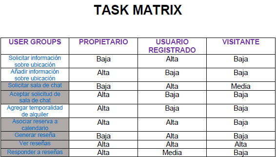

## DIU - Practica2, entregables

#### Índice
- Malla receptora de información
- Sitemap & Task flow
- Labelling
- Wireframe & User flow

#### UX Design
##### 1. FeedBack Capture Grid

  En este apartado del diseño UX recabamos de manera específica en una **malla receptora de información (feedback capture grid)** la información obtenida a partir de la **investigación y análisis del diseño UX(UX Desk Research & Analisis)**. Esta técnica se basa en cubrir cuatro apartados:

  - Aspectos positivos actualmente existentes en el diseño (elementos interesantes o relevantes).
  - Críticas constructivas sobre los principales problemas de diseño.
  - Preguntas al usuario para mejorar el sistema entorno a las necesidades de los visitantes y usuarios del sistema (a partir de las personas ficticias de la P1).
  - Ideas de mejora (equipo de desarrollo), que tienen más que ver con la parte de la implementación.

  

  [[FeedBack Capture Grid]](FeedBackCaptureGrid.pdf)

  **PROPUESTA DE VALOR**

  Como propuesta de valor a partir del FeedBackCaptureGrid generaremos una serie de implementaciones en el sistema que iremos desarrollando en posteriores apartados en forma de tareas y arquitectura del diseño. Todas estas modificaciones seguirán un patrón que favorezca el minimalismo del sistema y al mismo tiempo aportar funcionalidades concretas y especificas para guiar al usuario independientemente de su experiencia de manera satisfactoria por la interfaz.

  En función de las preguntas de los usuarios generaremos mayor vínculo entre los usuarios que pretenden utilizar el sistema para alquilar inmuebles como los que pretenden gestionar sus propios inmuebles a través de la plataforma. Además de esto, maximizar el aprendizaje de uso de la interfaz de manera sencilla e intuitiva para los mismos. Finalmente satisfacer de manera más completa las inquietudes del visitante/usuario registrado que se proponga alquilar un inmueble, con nuevas opciones que vinculen información relevante sobre el inmueble y alrededores y permitir al interesado elegir con comodidad entre las opciones visibles.

  Finalmente en cuanto a las ideas de los desarrolladores (en este caso, yo mismo las impongo), se pretende cohesionar de manera más elegante el frontend enlazando las funcionalidades de manera encadenada en forma de arbol. De esta manera, el usuario podrá navegar por la interfaz en sentido ascendente y descendente aumentando la comodidad y guiando al usuario de manera implícita. Por otro lado, diseñar una interfaz de chat(textual) para comunicar al cliente y al propietario independientemente de si este es usuario registrado o no. En caso de ser usuario registrado, poseerá mayores beneficios a la hora de comunicarse con el propietario. Como último punto, el sistema de reseñas considero que es una manera de permitir a los usuarios informarse y dar feedback sobre las experiencias de usuario a la hora de utilizar la aplicación y durante la gestión del proceso de alquiler.

##### 2. Tasks & Sitemap
  En este punto del desarrollo del diseño, hacemos uso tanto de nuestra propuesta de valor como de la información registrada en nuestro **feedback capture grid**. De esta forma, construirmos **tareas(tasks)** nuevas que resolverán problemas de diseño previos y mejoraran la calidad del sistema y la relación de este con los usuarios. Estas **tasks** vendrán recogidas en una **Task Matrix**.

  He escogido esta manera de representación para las tareas puesto que de tal forma, quedan recogidas en función de los grupos de usuarios. La combinación de grupo de usuario y tarea genera una frecuencia que indica el uso de esta por medio del usuario implicado. Teniendo en cuenta la importancia de la distinción de los grupos de usuario y su relación entre sí dentro del sistema, considero que esta es la mejor manera de enlazar las tareas y sus frecuencias. Esto permitirá determinar las tareas fielmente a su desarrollo en el sistema teniendo en cuenta la frecuencia de uso de estas por medio de los usuarios, que dan vida a su funcionalidad. Así mismo dará sentido a cada una de ellas y su desempeño en el sistema.

  

  [[Task Matrix]](TaskMatrix.pdf)
