## DIU - Practica 3

### ÍNDICE
- 3.a Análisis de MuseMap
- 3.b Investigación de patrones de diseño y guidelines
- 3.c Video UX Case Study
- 3.d Documentación
#### 3.a Análisis de MuseMap

MuseMap Street Art App se conoce como una aplicación diseñada con el objetivo de solventar la curiosidad de la sociedad acerca del arte que le rodea. Trata de eliminar el desconocimiento sobre nuestro entorno y cubrir nuestra curiosidad buscando informarnos acerca de aquello que nos interesa.

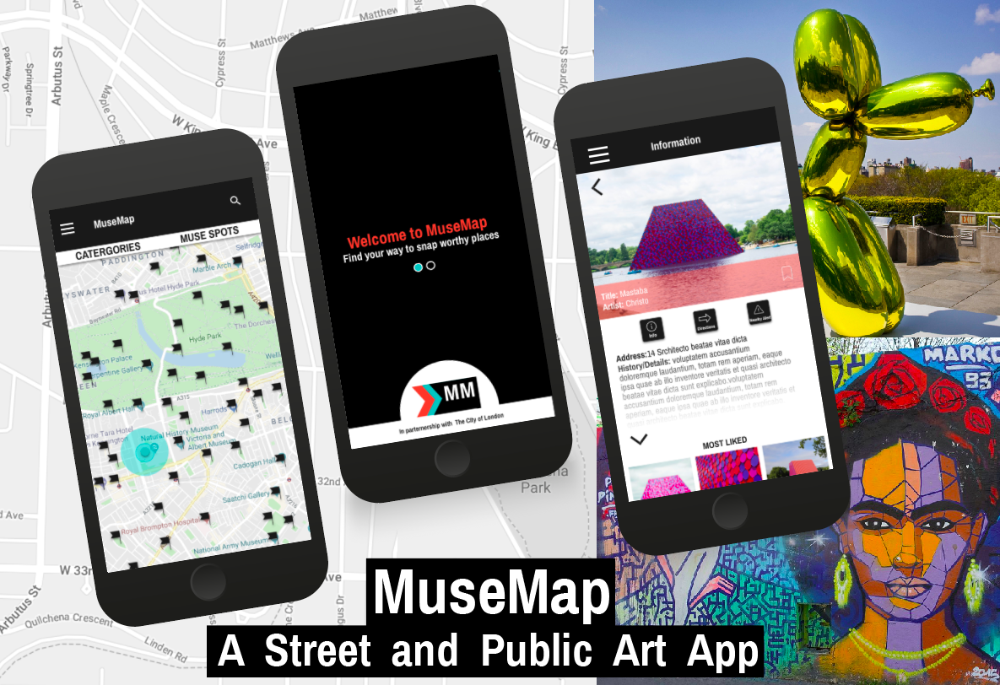

Principalmente el marco de trabajo de esta aplicación se desarrolla en el ámbito local de Londres, por lo tanto tendrá una relación directa con la sociedad Británica. Esto implica un desarrollo cultural específico dentro del marco de diseño del UX Case Study que nos disponemos a analizar.

##### Análisis de los métodos UX (MuseMap)

Para analizar individualmente de manera fiel los métodos UX usados en el desarrollo de MuseMap, debemos conocer las pretensiones de los creadores y de los clientes de la app (ciudad de Londres). 

Principalmente, la idea con este proyecto era culturizar tanto a los visitantes como a los locales de la ciudad acerca del arte que esta alberga, crear interés entre la gente sobre el mismo. De esta manera, se conseguiría consagrar a londres en la escena artística como una de las ciudades mas cotizadas si todo salía según lo esperado. Finalmente, promover el arte público y potenciar el arte en la sociedad Londinense.

Una vez presentada la oportunidad de dar soporte a esta idea, se plantearon varios proyectos en los que trabajar para darle forma. Durante este brain storming se recogieron ideas como:

- Apps interactivas para conocer la localización de las piezas artísticas en la ciudad y marcarlas para futuras visitas.
- Juegos para incentivar a la gente a descubrir el arte Londinense.
- Apps que permitan al usuario conocer más información acerca del arte que se exhibe en las calles.
- Apps que incluyan conexiones sociales multimedia para compartir multimedia.

Algunas de estas ideas estaban pensadas para complementarse, como las dos últimas.

Una vez estudiadas las oportunidades, pasaron al marco de Usuario. Para ello tomaron en cuenta un User Research o también conocido como Ethnography research.

##### Ethnography Research & Empathy Map

Este método UX es utilizado para ponerse en el punto de vista de otra persona, en este caso de un usuario potencial y ver la proyección de su punto de vista acerca del proyecto.

El grupo de diseño optó por generar entrevistas con usuarios potenciales y al mismo tiempo hacer un brainstorming que les brindara opciones para ponerse en la piel del usuario promedio de la app. Esto en principio lo vieron suficiente para abordar el diseño. Plantearon esta metodología para asumir los potenciales usuarios objetivo y sus necesidades, sin embargo olvidaron la generación de captación de nuevos usuarios no tan potenciales , que es lo que se plantea en el grupo de objetivos de la app tal y como describimos en primera instancia.

Según mi criterio deberían haber generado un marco de trabajo más genérico e intentado buscar una perspectiva diagonal a la de usuarios interesados para maximizar el interés de la sociedad británica indepedientemente de su influencia en el arte. De hecho se puede ver claramente como simplemente se enfocan en las personas que están directamente relacionadas con el mundo del arte tanto profesional como personalmente. 

Esta investigación etnográfica debería de surcar puntos de vista divergentes para ser totalmente válida y fiel a la solución del problema que toma la app.

De manera enlazada se genera un Empathy map para sintetizar las observaciones previas e identificar las necesidades de los usuarios cuyos puntos de vista han sido explorados. De esta investigación sacan conclusiones de las necesidades de estos usuarios para posteriormente continuar con estudios más profundos del diseño UX.

##### Contextual Inquiry
 
Se trata de un estudio contextual del entorno en el que se desarrollará la aplicación para crear un diseño que se adapte de manera fluida al mismo sin resultar ser inutil o tedioso.

Para ello realizaron observaciones a pie de calle y tomaron información relevante para posteriormente continuar con el diseño, lo cuál los llevara a desarrllar un Competitive Analysis.

##### Competitive Analysis

El análisis competitivo es una herramienta la cuál estudiamos en la P1 y es realmente importante incluirla en todas las etapas de investigación pues así evitamos "reinventar la rueda" y simplificamos el trabajo de diseño. Además de esto nos ayuda a conocer a potenciales competidores y poder sacar mejoras que nos hagan ser competitivos a buen nivel.

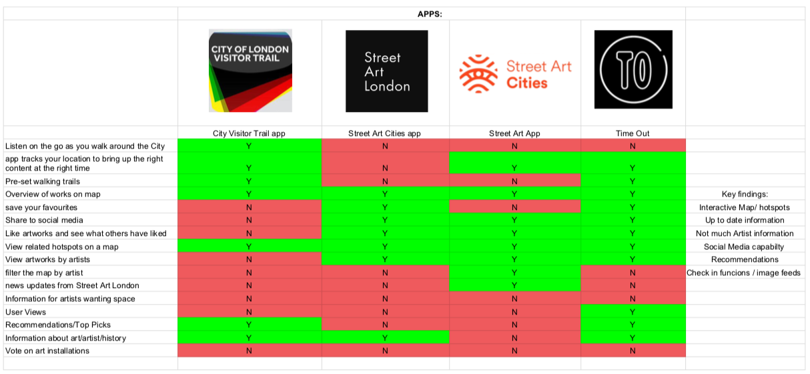

La principal característica de este método es analizar aplicaciones similares para poder inspirarse y mejorar el futuro diseño en torno a la competencia del sector.

En este caso, se basaron en la investigación de aplicaciones que incluyen características similares a las que pretenden implementar y clasificaron las mismas según las características que han recopilado. De esta manera organizarán estas por sus puntos fuertes y débiles. Esto les aportará información sobre la competencia y podrá dar ideas sobre un principio de diseño.

De manera genérica todas las apps contienen un mapa interactivo con puntos de interés artísticos a visitar, algo imprescindible. De igual manera implementan un marco social para compartir experiencias culturales. Según su criterio faltó una sección de top picks/recomendaciones de usuarios. Finalmente todas las apps recogían su información de una base de datos repleta de información sobre los artistas y obras.

##### Empathy Map

De manera previa a pasar al marco del User Research se tuvo en cuenta un brainstorming que derivó en un Empathy Map. Este mapa fué usado para generar preguntas adecuadas en el proceso de User Research durante las entrevistas con usuarios potenciales. Todo este brainstorming derivó en:

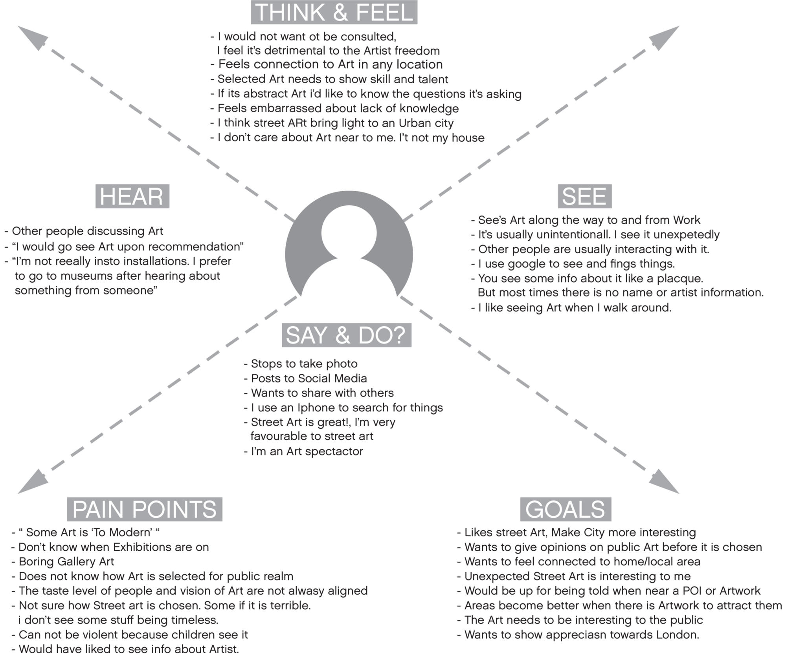

Este Empathy Map se divide en 4 áreas principales y deriva en puntos negativos y objetivos.

Las 4 areas principales son:

- Think & Feel: Determina lo que los usuarios piensan y sienten acerca del arte y las necesidades que estos sienten que deberían ser solventadas.

- Hear: Pensamiento acerca de ser informados acerca de arte. Plantean los medios que les parecen útiles y los que les resultan incómodos para nutrirse de cultura.

- See: Visión acerca del arte y de la interacción del entorno con el.

- Say & Do?: ¿Qué es lo que estos hacen cuando interactuan con arte?

Los puntos negativos y objetivos plantean:

- Pain Points: Determina lo negativo del arte según varios puntos de vista y su experiencia de usuario.

- Goals: Expone los objetivos desde los puntos de vista de la sociedad Londinense.

Una vez revisados estos puntos referentes al mapa, sin entrar demasiado en detalle, comprobamos que definen correctamente el contexto incial del proyecto antes de su diseño y su potencial. Puesto que vemos desde una postura empática la situación actual con respecto al entorno artístico. Este estudio acompañado de una revision de usabilidad sería mucho más completo.

Propongo una mejora con una ampliación del Desk Research & Analysis añadiendo una revisión de usabilidad. Esta propuesta se debe a que tenemos una gran fuente de información tras el desarrollo del empathy map, lo cuál nos puede llevar a generar una revisión de usabilidad certera que podrá llevar a un buen puerto a la aplicación sobretodo en la etapa de User Research.

##### User Interviews

En este caso, tras el desarrollo de una investigación inicial correcta, se pasa a un marco de entrevistas, en el cuál se le plantean las preguntas adecuadas a un grupo de personas acerca del proyecto, para tener un feedback tratable sobre el mismo. Esto no sería útil sin el uso de un buen empathy map que nos guíe a la hora de realizar las preguntas.

El análisis etnográfico también nos ayuda a comprender el framework al que se enfrenta el proyecto, al fin y al cabo todo nuestro trabajo se basa en contentar a un cliente y dar la mejor experiencia de usuario posible, por lo tanto, adaptarse a la sociedad es más que imprescincible.

##### Affinity Mapping

Durante este proceso, se plantea recoger la información generada para crear afinidad entre la idea original del proyecto y la percepción adquirida tras el estudio del marco de usuario.

Todas esas ideas fragmentadas son conectadas según sus diferencias y finalmente crean una base de proyecto afín a lo que el desarrollador busca.

La conclusión del mapa de afinidad determina las características que previamente no tuvieron en cuenta al desarrollar el planteamiento original y complementan este modificandolo hasta cumplir con las expectativas de ambas partes interesadas.

##### User Personas 

En el bloque de generación de personas, se plantearon dos perfiles para identificar los objetivos y los puntos débiles del proyecto de manera más específica. Personalmente comprendo su importancia, pues permiten ahondar más individualmente características especificas que no serían evaluables desde un marco global. 

Con un marco global me refiero al framework que trabajan métodos como el empathy map, pues trabajan de manera que se proyecta la vision desde una perspectiva muy lejana al la interacción.

Las personas escogidas en este método fueron:

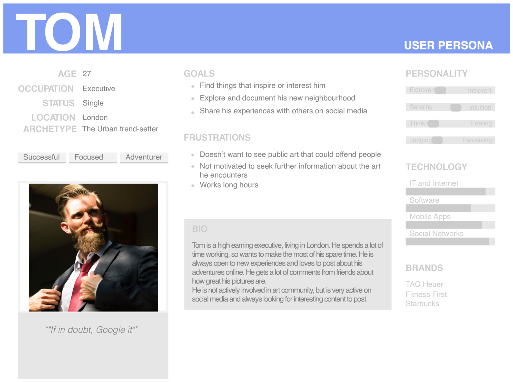
Primary User Persona, Tom

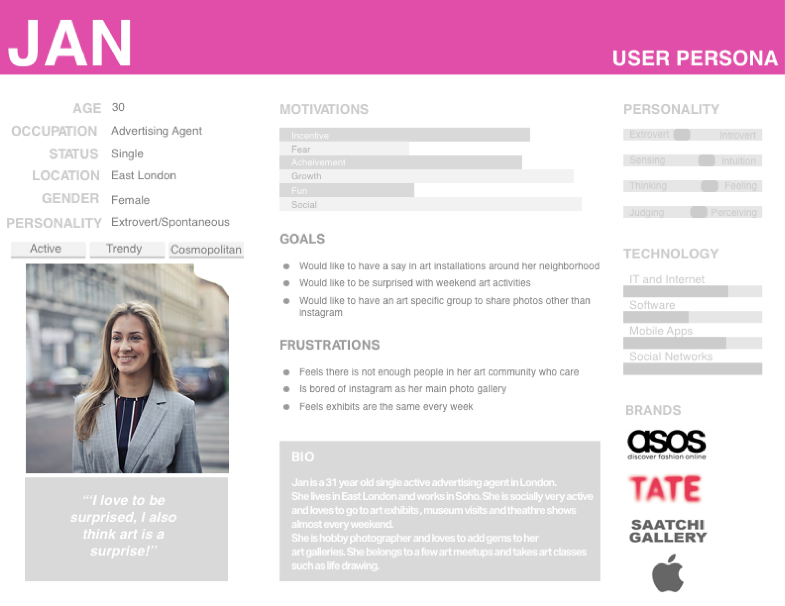
Secondary User Persona, Jan

##### User Goals & User Pain Points

Tras generar los perfiles de usuarios pertinentes, se busca tomar en cuenta los objetivos de ambos en el marco de trabajo en el que nos encontramos y sobre todo enlazar sus posibles objetivos relacionados con nuestro proyecto.

En el caso de los pain points, buscamos aquello que los usuarios no buscan a la hora de interactuar con el marco de trabajo en el que se desarrolla la aplicación.

El planteamiento seleccionado por parte de los diseñadores de esta herramienta me parece excepcional, pues en este caso se premia mucho la capacidad del sistema para satisfacer su usabilidad. Si no tiene una capacidad de encontrar hueco entre las aplicaciones rutinarias de los usuarios, no tendrá ningún éxito. Por lo tanto enfocar los puntos objetivo como los puntos a evitar es fundamental a la hora de plantear un user jouney.

De hecho, estos planteamientos hacen referencia a los métodos previos utilizados, en los cuales tomabamos estos goals y pain points como principal finalidad.

##### User Journey

El User Journey plantea un supuesto de experiencia de usuario para hacer un seguimiento según unos User persona determinados y atravesar por diversas fases orientadas al marco de trabajo en el que estamos diseñando.

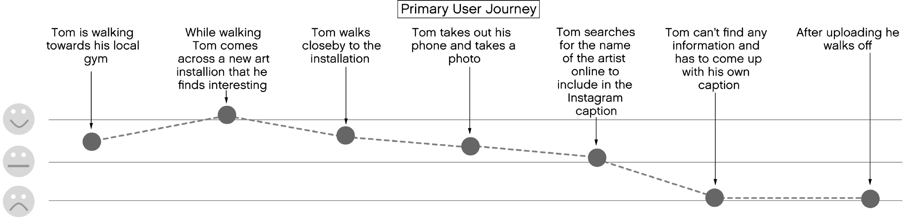

En este caso tomaron en cuenta a Tom para generar el User Journey. Yo sin embargo considero que sería mejor diagonalizar los User Journey en cuanto a experiencia y pericia con el marco de trabajo. De esta manera abarcaríamos más terrenos y podríamos llegar a especificar más sobre funcionalidades del mismo en un futuro.

##### Experience Map

Como podemos comprobar se trata de una simplificación del método User Journey Map, pues por una parte describen un User Journey y por otra parte examinan la experiencia de usuario y su "mood" durante el proceso de "journey". 

Bajo mi punto de vista presenta una estructura demasiado dispersa y no permite una profundización óptima. Yo plantearía un User Journey Map que describiese una experiencia de usuario real en la cual, nuestro proyecto tuviese impacto, para comprender el nicho de uso que este posee y evaluar la experiencia de usuario en diversos escenarios teniendo en cuenta los User Persona descritos. De ahí la importancia de crear dos o más perfiles diagonalmente distintos.

##### User Scenarios 

User Scenarios se postula como una herramienta para determinar unos cuantos más escenarios para desarrollar la app con más información previa sobre futuribles escenarios y su relacion con los usuarios.

Esto ayuda a conocer la solución del problema de alcanzar los objetivos de usuario sin aumentar los puntos negativos de la misma bajo las experiencias de usuario. De esta manera se exploran nuevos casos y se reducen las posibilidades de incumplir con las necesidades de los usuarios.

##### Problem Statement

A la hora de plantear el problema de manera formal se define como:

>> People who live in or visit the City of London need a way to engage more with public art because their engagement is currently short lived and shallow.

##### User Flow

Después de formular el planteamiento del problema comenzamos con el proceso de diseño. Para comenzar con el mismo, se planteó definir el "user flow" enfocado en Tom usando la app en una situación concreta.

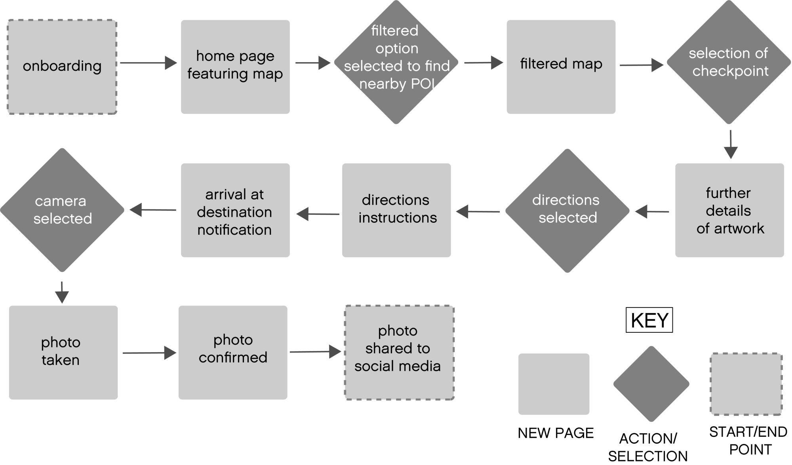

En este caso es conveniente desarrollar un flujo de usuario referente a la aplicación en un contexto determinado. Esto nos ayudará a profundizar en un escenario que incluya nuestro producto y ver como se desenvuelve en ese entorno bajo la percepción del usuario que permite el "flow". 

Sin embargo, yo lo adjuntaría al mapa de experiencia de usuario y así de esa manera llegaría al mismo tiempo a una conclusión en torno a la experiencia posible que podría vivir ese usuario en esa situación determinada. 

#### 3.b Investigación de patrones de diseño y guidelines

En este punto del diseño de nuestro servicio, debemos tomar decisiones acerca de patrones de diseño y pautas(guidelines) a aplicar en el prototipado de alta definición del proyecto.

Desde el planteamiento inicial del problema, Competitive Analysis y demás estados de diseño he considerado como prioritario un diseño minimalista centrado en la facilidad y accesibilidad. Esto según mi criterio se adapta a todo tipo de usuario, puesto que pone a su disposición una amplia gama de opciones sin abrumar su percepción.

Puesto que nos encontramos en una situación de decidir el camino que tomará el diseño de la app, es necesario ir en búsqueda de elementos minimalistas que proporcionen la funcionalidad suficiente en un entorno que siga un diseño estructurado y simplista.

En primer lugar, el diseño global de la aplicación seguirá un patrón de diseño por capas o niveles. Esta decisión se basa en la necesidad de mantener una estructura ordenada que guie al usuario entre pestañas minimalistas que le aporten la información y acciones necesarias en cada instancia del programa. La forma más limpia de conseguir esto es tomar un diseño por niveles.

###### DISEÑO POR NIVELES
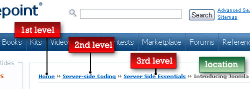

Por otra parte sería interesante implementar un diseño de "Read More" para las secciones textuales que lo requieran, sobre todo las pertenecientes a páginas intermedias de selección en las que se le indica resumidamente al usuario las acciones a llevar a cabo. De esta manera continuaremos manteniendo la estructura minimalista y eficiente. Aparte de esto, mantendremos la estructura ordenada para evitar abrumar con exceso de información y crearemos más cohesión entre información.

###### READ MORE
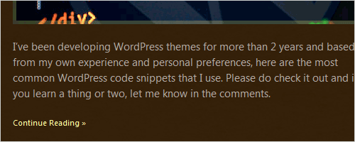

En cuanto al buscador, mantendremos un diseño limpio y sencillo en el cual solo se mostrará una barra simple donde introducir texto, con una opción de menú que abre un abanico de opciones de filtro. De esta manera todo lo referente a botoneras y espacios de búsqueda lo mantendremos como abanicos de opciones que simplificaran el diseño y evitaran diferir del resto de información.

###### BUSCADOR
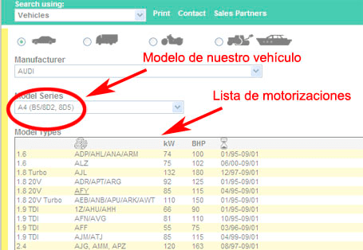

Finalmente en cuanto al diseño global de la aplicación tendremos en cuenta iconos, formatos de texto e imágenes que evoquen minimalismo y agraden a la vista. La finalidad de las herramientas textuales y de imagen es captar la atención del usuario y mantenerlo pendiente de toda la información procedente de su monitor. Al fin y al cabo el ser humano se guía mucho por la apariencia visual y la estructuración del contenido. Las interfaces limpias y sencillas suelen ser muy agradables de manejar

###### FUENTES MINIMALISTAS
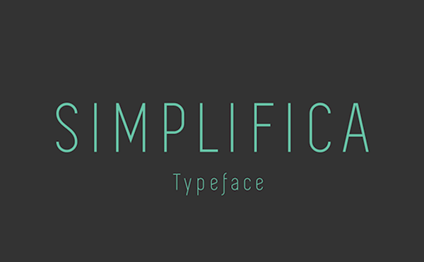
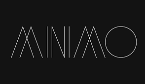

###### ICONOS MINIMALISTAS
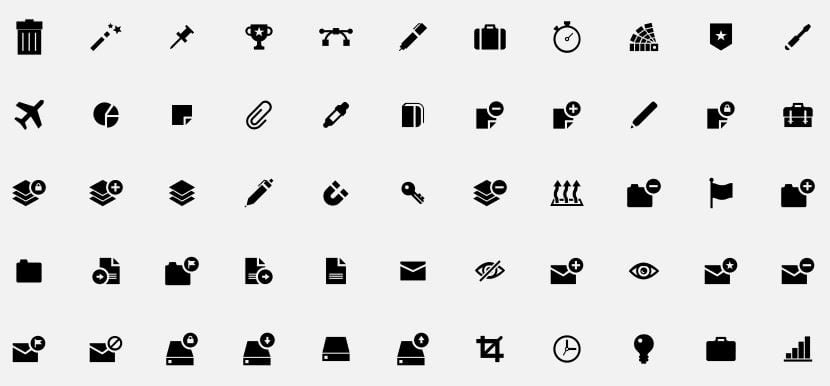

Como ejemplo de una buena praxis del minimalismo en el diseño de apps y páginas web, tenemos este ejemplo:

###### EJEMPLO PÁGINA WEB
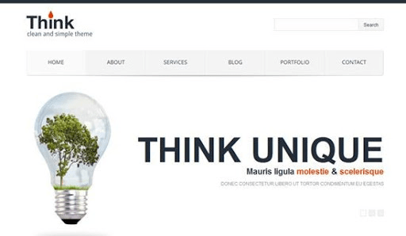

