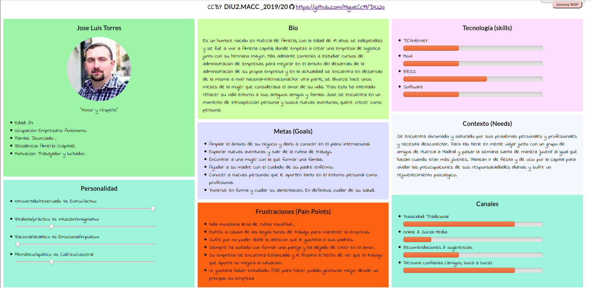
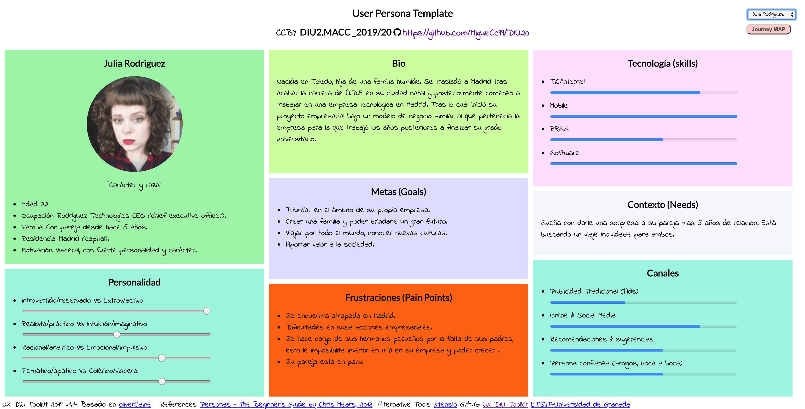
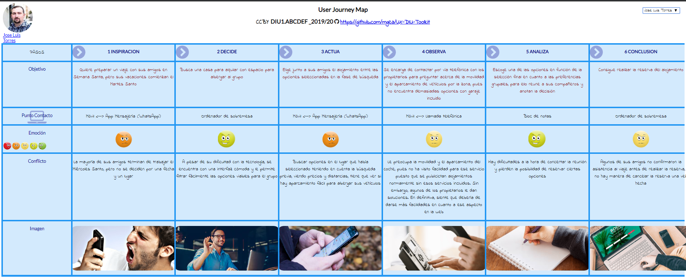
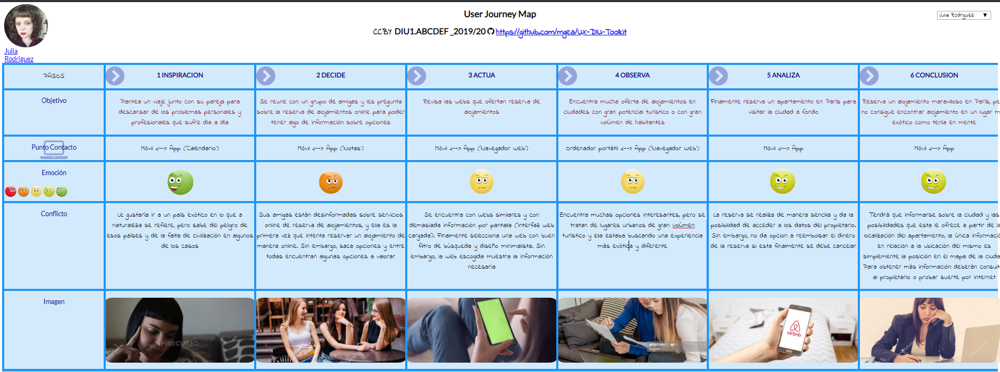
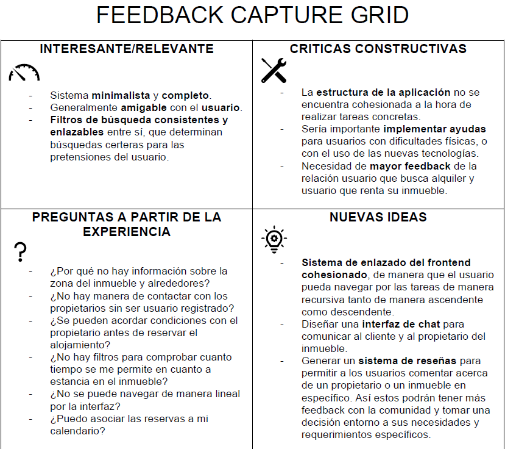
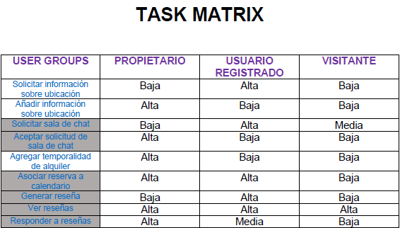
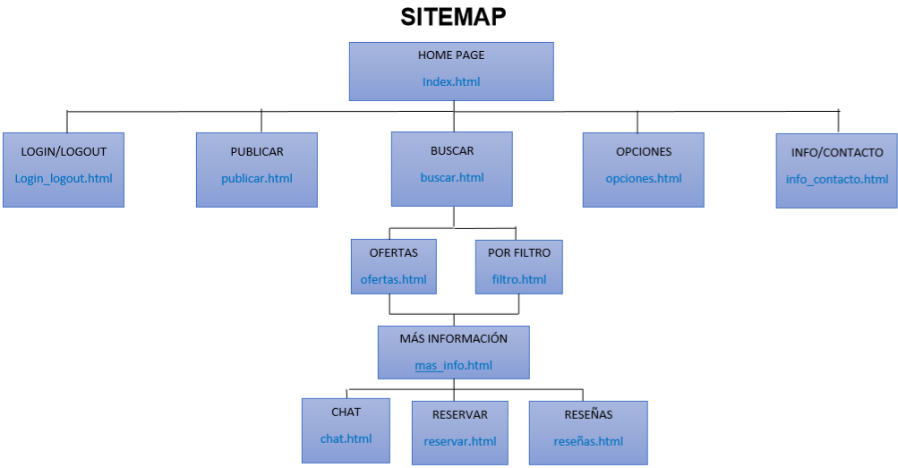
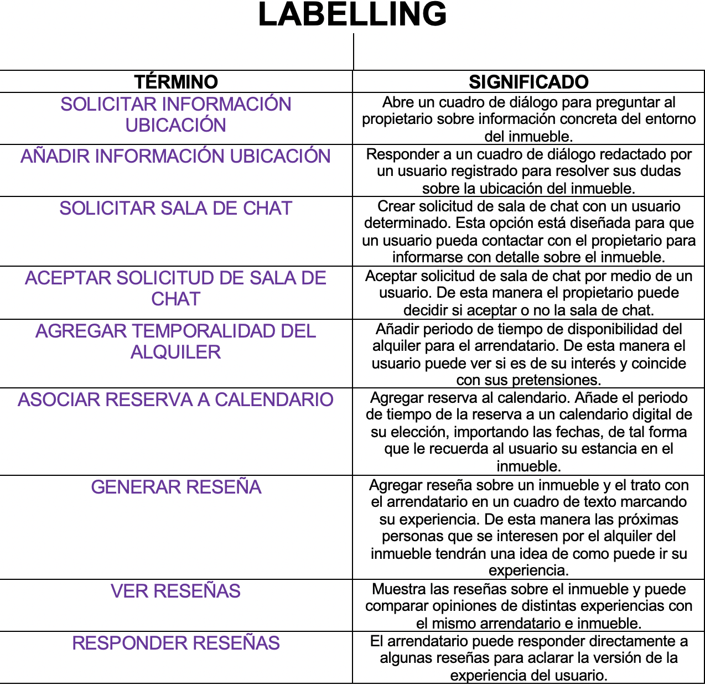

# DIU20
Prácticas Diseño Interfaces de Usuario 2019-20 (Economía Colaborativa)

Grupo: DIU2.  Curso: 2019/20

Proyecto: Plataformas de economía colaborativa. Experiencias de compartir alojamiento.

Descripción: estudio de varias plataformas de economía colaborativa (Web y App's) sobre diferentes modelos de negocio, en este caso abarcaremos experiencias de compartir alojamiento.

Logotipo:

Miembros
 * :bust_in_silhouette:   Miguel Ángel Campos Cubillas     :octocat:

-----

En esta práctica estudiaremos un caso de plataforma de economía colaborativa y realizaremos una propuesta para su diseño Web/movil. Utilizaremos herramientas y entregables descritos en el siguiente CheckList (https://github.com/mgea/UX-DIU-Checklist)

Qué es economia colaborativa: Martínez-Polo, J. (2019). **El fenómeno del consumo colaborativo: del intercambio de bienes y servicios a la economía de las plataformas**, *Sphera Publica, 1*(19), 24-46. http://sphera.ucam.edu/index.php/sphera-01/article/view/363/14141434

# Proceso de Diseño

## Paso 1. UX Desk Research & Analisis

 1.a Competitive Analysis
-----
Las aplicaciones seleccionadas en este proceso de análisis de competencia se basan en plataformas que hacen de intermediario entre un usuarios que solicitan rentar alojamientos y usuarios que requieren alquilar sus propios bienes.

Basan su sistema en un portal de búsqueda por filtros (de búsqueda), lo cuál permite a los usuarios encontrar sus alojamientos según preferencias personales.

[[Mostrar más sobre el: Análisis de Competencia]](P1/README.md)

 1.b Persona
-----
Durante el proceso de creación de las personas, he decidido tomar la iniciativa de crear dos perfiles humanos muy divergentes con el motivo de poder explorar por experiencias de usuario desafiantes para el sistema.

###### JOSE LUÍS TORRES

[[Ver más sobre: Jose Luís]](P1/p1_jose_luis_torres.png)

###### JULIA RODRIGUEZ

[[Ver más sobre: Julia]](P1/p2_julia_rodriguez.png)

 1.c User Journey Map
----
Estas experiencias de usuario han sido escogidas puesto que cumplen con similitudes en cuanto a problemas comunes a la hora de gestionar acciones en entornos como el que nos disponemos a analizar, pero desde puntos de vista muy distantes en cuanto a uso de la tecnología se refiere.

###### EXPERIENCIA DE USUARIO 1 (JOSE LUÍS TORRES)

[[Ver más sobre: Experiencia de Usuario 1]](P1/jm1_jose_luis_torres.PNG)

###### EXPERIENCIA DE USUARIO 2 (JULIA RODRIGUEZ)

[[Ver más sobre: Experiencia de Usuario 2]](P1/jm2_julia_rodriguez.PNG)

 1.d Usability Review
----
### Revisión de usabilidad:

#### Enlace al documento:  (sube a github el xls/pdf)
[[Documento de revisión de usabilidad]](P1/Usability-review-template.xlsx)
#### Valoración final (numérica):
>>> - 76
#### Comentario sobre la valoración:  (60-120 caracteres)
Según la valoración de la revisión de usabilidad podemos determinar que estamos ante un sistema que cumple correctamente con sus requerimientos principales. Tal es así que podría llegar a satisfacer a amplia gama de usuarios, sin embargo, tiene puntos importantes a mejorar.
[[Ver más]](P1/README.md)
## Paso 2. UX Design

 2.a Feedback Capture Grid
----

[[FeedBack Capture Grid]](P2/FeedBackCaptureGrid.pdf)

- Propuesta de Valor :
  - La propuesta de valor que propongo para nuestro proyecto es crear un entorno minimalista y conciso con gran adaptabilidad tanto para nuevos usuarios como experimentados. Además de esto generar un sitema de feedback entre los componentes del sistema. Esto se consigue conectando desde los stakeholders del sistema hasta los visitantes (usuarios no registrados) del mismo.

 2.b Tasks & Sitemap
-----
En este punto del desarrollo del diseño, hacemos uso tanto de nuestra propuesta de valor como de la información registrada en nuestro **feedback capture grid**. De esta forma, construirmos **tareas(tasks)** nuevas que resolverán problemas de diseño previos y mejoraran la calidad del sistema y la relación de este con los usuarios. Estas **tasks** vendrán recogidas en una **Task Matrix**.

[[Task Matrix]](P2/TaskMatrix.pdf)

 2.c Labelling
----
En este punto del diseño de nuestro sistema, hemos identificado los términos para diálogo con el usuario que mostrará nuestra interfaz de usuario. Para identificarlos adecuadamente deberemos describir su acción y su cometido. Es decir, lo que provoca a nivel sistema y a nivel de percepción del usuario sobre sus acciones. Para ello hemos desarrollado un **Sitemap** y propuesto un **Labelling** para sus elementos. Con esto generamos una organización lógica de la navegación y de los elementos de diseño de manera sólida.

- SITEMAP:

[[Sitemap]](P2/Sitemap.pdf)

- LABELLING:

[[Labelling]](P2/Labelling.pdf)

 2.d Wireframes
-----
El cometido de los wireframes es crear un diseño del layout para Web o Móvil en su defecto, de tal manera que se genere una simulación que nos permita organizar el layout final del sistema. Para ello hemos hecho uso de los Bocetos Lo_Fi.

[[Bocetos Lo_Fi]](P2/BocetosLoFi.pdf)

## Paso 3. Make (Prototyping)

 3.a Moodboard
-----

>>> Plantear Diseño visual con una guía de estilos visual (moodboard)

  3.b Landing Page
----

>>> Plantear Landing Page

 3.c Guidelines
----

>>> Estudio de Guidelines y Patrones IU a usar

  3.d Mockup
----

>>> Layout: Mockup / prototipo HTML  (que permita simular tareas con estilo de IU seleccionado)

## Paso 4. UX Check (Usability Testing)

 4.a A/B Testing
----

>>> Comprobacion de asignaciones para A/B Testing. Asignaciones https://github.com/mgea/DIU19/blob/master/ABtesting.md

>>>> Práctica A:

 4.b User Testing
----

>>> Usuarios para evaluar prácticas

| Usuarios | Sexo/Edad     | Ocupación   |  Exp.TIC    | Personalidad | Plataforma | TestA/B
| ------------- | -------- | ----------- | ----------- | -----------  | ---------- | ----
| User1's name  | H / 18   | Estudiante  | Media       | Introvertido | Web.       | A
| User2's name  | H / 18   | Estudiante  | Media       | Timido       | Web        | A
| User3's name  | M / 35   | Abogado     | Baja        | Emocional    | móvil      | B
| User4's name  | H / 18   | Estudiante  | Media       | Racional     | Web        | B

. 4.c Cuestionario SUS
----

>>> Usaremos el **Cuestionario SUS** para valorar la satisfacción de cada usuario con el diseño (A/B) realizado. Para ello usamos la [hoja de cálculo](https://github.com/mgea/DIU19/blob/master/Cuestionario%20SUS%20DIU.xlsx) para calcular resultados sigiendo las pautas para usar la escala SUS e interpretar los resultados
http://usabilitygeek.com/how-to-use-the-system-usability-scale-sus-to-evaluate-the-usability-of-your-website/)
Para más información, consultar aquí sobre la [metodología SUS](https://cui.unige.ch/isi/icle-wiki/_media/ipm:test-suschapt.pdf)

>>> Adjuntar captura de imagen con los resultados + Valoración personal

 4.c Usability Report
----

>> Añadir report de usabilidad para práctica B

## Paso 5. Evaluación de Accesibilidad

  5.a Accesibility evaluation Report
----

>>> Indica qué pretendes evaluar (de accesibilidad) y qué resultados has obtenido + Valoración personal

>>> Evaluación de la Accesibilidad (con simuladores o verificación de WACG)

## Conclusión / Valoración de las prácticas

>>> (90-150 caracteres) Opinión del proceso de desarrollo de diseño siguiendo metodología UX y valoración (positiva /negativa) de los resultados obtenidos
