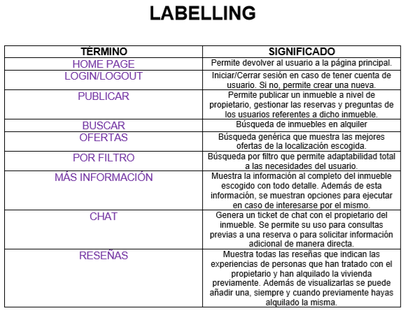

# DIU20
Prácticas Diseño Interfaces de Usuario 2019-20 (Economía Colaborativa)

Grupo: DIU2.  Curso: 2019/20

Proyecto: Plataformas de economía colaborativa. Experiencias de compartir alojamiento.

Descripción: estudio de varias plataformas de economía colaborativa (Web y App's) sobre diferentes modelos de negocio, en este caso abarcaremos experiencias de compartir alojamiento.

Logotipo:

Miembros
 * :bust_in_silhouette:   Miguel Ángel Campos Cubillas     :octocat:

-----
# UX Case Study

Vivimos en un mundo que se encuentra en estado frenético, y nosotros como parte de el estamos en constante movimiento, cambios en todos los aspectos de nuestro ser. En muchas ocasiones nos encontramos con la necesidad de echar raices en otro lugar, o simplemente necesitamos desplazarnos durante un periodo de tiempo a una localización diferente. 

Ahí es donde entra la siguiente pregunta, ¿Te gustaría encontrar el lugar perfecto para vivir?

## Introducción

>¿Cómo encuentro la mejor opción de alojamiento disponible?

>> Esta es la pregunta a la cuál queremos dar respuesta con este proyecto de diseño. El principal incentivo de este diseño de sistema es permitir a cualquier usuario encontrar el alojamiento ideal en un entorno familiar para evitar que llegue a plantearse la misma pregunta.

## Objetivos

- Estudiar varios nichos de negocio en el entorno del sector del alojamiento y generar una propuesta más atractiva de las existentes.
- Generar un diseño limpio y eficiente en un entorno fácil de usar y con múltiples herramientas de búsqueda.
- Ayudar en el plano social a la gente a encontrar ofertas de alojamiento afines a sus necesidades.

## Esquema incial

Se han presentado esquemas genéricos como:

- App móvil interactiva que permita el contacto social en el entorno de compartir alojamiento.

- Plataforma web que proponga alternativas para incluir ofertas de alojamiento.

## Estudio del contexto

Principalmente los usuarios que utilizan esta clase de sistemas, buscan una solución rápida y eficaz a su problema de búsqueda de alojamiento.

Los puntos clave son:
- Variedad de filtros y opciones en los sistemas de búsqueda.
- Contacto sistemático con el propietario del inmueble.
- Información necesaria y fiel.
- Facilidad y seguridad en pagos y acuerdos.
- Navegabilidad sencilla y rápida por menus contextuales.

## UX Desk Research & Analisis

 1.a Competitive Analysis
-----

Para comenzar con el diseño del sistema de comparto de aplicaciones, deberemos estudiar el entorno competitivo en el que se encontrará la aplicación al salir al mercado. 

Existen varios sistemas de comparto de alojamiento ya en funcionamiento en la red, con sus correspondientes estructuras web y de tipo app movil. En este análisis previo, vamos a discernir entre las funcionalidades genéricas y escoger la más afin a nuestro objetivo, la cuál seguiremos de ejemplo para no "reinventar la rueda" y crear una buena propuesta de valor en el futuro y dar un servicio correcto.

Las aplicaciones seleccionadas en este proceso de análisis de competencia se basan en plataformas que hacen de intermediario entre un usuarios que solicitan rentar alojamientos y usuarios que requieren alquilar sus propios bienes.

Basan su sistema en un portal de búsqueda por filtros (de búsqueda), lo cuál permite a los usuarios encontrar sus alojamientos según preferencias personales.

[[Mostrar más sobre el: Análisis de Competencia]](P1/README.md)

 1.b Persona
-----
Durante el proceso de creación de las personas, he decidido tomar la iniciativa de crear dos perfiles humanos muy divergentes con el motivo de poder explorar por experiencias de usuario desafiantes para el sistema. Esta decisión dará pie a explorar ramas del sistema que podemos no haber tenido en cuenta a la hora de pensar en los puntos clave de la funcionalidad del sistema.

Este punto es sumamente importante por lo previamente expuesto, ya que el hecho de crear perfiles potenciales de casos opuestos de usuarios del sistema, permitirá una adaptabilidad mayor, y con una calidad de diseño de calidad.

En primer lugar, tenemos un perfil de un hombre no adaptado a la tecnología que requiere del uso de una herramienta como la nuestra y se encuentra en una situación en la que requiere de ayuda externa. Por otra parte, el segundo perfil, lo ocupa una mujer adaptada a la comunidad tecnológica y con otras inquietudes muy dispares. Esto nos permite ahondar en detalles del sistema diagonales que no se podrían visualizar de manera conjunta

###### JOSE LUÍS TORRES

[[Ver más sobre: Jose Luís]](P1/p1_jose_luis_torres.png)

###### JULIA RODRIGUEZ

[[Ver más sobre: Julia]](P1/p2_julia_rodriguez.png)

 1.c User Journey Map
----

Estos User Journey Map representan dos escenarios en este caso, en los que un usuario podría interactuar con nuestro sistema, en resumidas cuentas evalua el estado emocional que estos usuarios sufren al pasar por las distintas etapas en las que este escenario los envuelve.

Los escenarios escogidos en los User Journey Map deben de ser fieles a las características de las personas que se encuentran afectadas por ellos, puesto que estos van a ser un gran indicativo de usabilidad del sistema. 

El desarrollo del "mood" de los participantes, determinará la situación de nuestro sistema en el entorno y los escenarios cotidianos en los que entra en acción. Lo que pretendemos con estos User Journey Map es generar un buen "mood" en el cliente durante el proceso de uso del sistema en su entorno, pues en ese caso, favorecerá el uso del sistema de manera sistemática.

###### EXPERIENCIA DE USUARIO 1 (JOSE LUÍS TORRES)

[[Ver más sobre: Experiencia de Usuario 1]](P1/jm1_jose_luis_torres.PNG)

###### EXPERIENCIA DE USUARIO 2 (JULIA RODRIGUEZ)

[[Ver más sobre: Experiencia de Usuario 2]](P1/jm2_julia_rodriguez.PNG)

 1.d Usability Review
----
### Revisión de usabilidad:

#### Enlace al documento:  (sube a github el xls/pdf)
[[Documento de revisión de usabilidad]](P1/Usability-review-template.xlsx)
#### Valoración final (numérica):
>>> - 76
#### Comentario sobre la valoración:  (60-120 caracteres)
Según la valoración de la revisión de usabilidad podemos determinar que estamos ante un sistema que cumple correctamente con sus requerimientos principales. Tal es así que podría llegar a satisfacer a amplia gama de usuarios, sin embargo, tiene puntos importantes a mejorar.
[[Ver más]](P1/README.md)

Principalmente el sistema debería de ser más estructurado
## UX Design

 2.a Feedback Capture Grid
----

[[FeedBack Capture Grid]](P2/FeedBackCaptureGrid.pdf)

- Propuesta de Valor :
  - La propuesta de valor que propongo para nuestro proyecto es crear un entorno minimalista y conciso con gran adaptabilidad tanto para nuevos usuarios como experimentados. Además de esto generar un sitema de feedback entre los componentes del sistema. Esto se consigue conectando desde los stakeholders del sistema hasta los visitantes (usuarios no registrados) del mismo.

 2.b Tasks & Sitemap
-----
En este punto del desarrollo del diseño, hacemos uso tanto de nuestra propuesta de valor como de la información registrada en nuestro **feedback capture grid**. De esta forma, construirmos **tareas(tasks)** nuevas que resolverán problemas de diseño previos y mejoraran la calidad del sistema y la relación de este con los usuarios. Estas **tasks** vendrán recogidas en una **Task Matrix**.

[[Task Matrix]](P2/TaskMatrix.pdf)

 2.c Labelling
----
En este punto del diseño de nuestro sistema, hemos identificado los términos para diálogo con el usuario que mostrará nuestra interfaz de usuario. Para identificarlos adecuadamente deberemos describir su acción y su cometido. Es decir, lo que provoca a nivel sistema y a nivel de percepción del usuario sobre sus acciones. Para ello hemos desarrollado un **Sitemap** y propuesto un **Labelling** para sus elementos. Con esto generamos una organización lógica de la navegación y de los elementos de diseño de manera sólida.

- SITEMAP:

[[Sitemap]](P2/Sitemap.pdf)

- LABELLING:

[[Labelling]](P2/Labelling.pdf)

 2.d Wireframes
-----
El cometido de los wireframes es crear un diseño del layout para Web o Móvil en su defecto, de tal manera que se genere una simulación que nos permita organizar el layout final del sistema. Para ello hemos hecho uso de los Bocetos Lo_Fi.

[[Bocetos Lo_Fi]](P2/BocetosLoFi.pdf)

